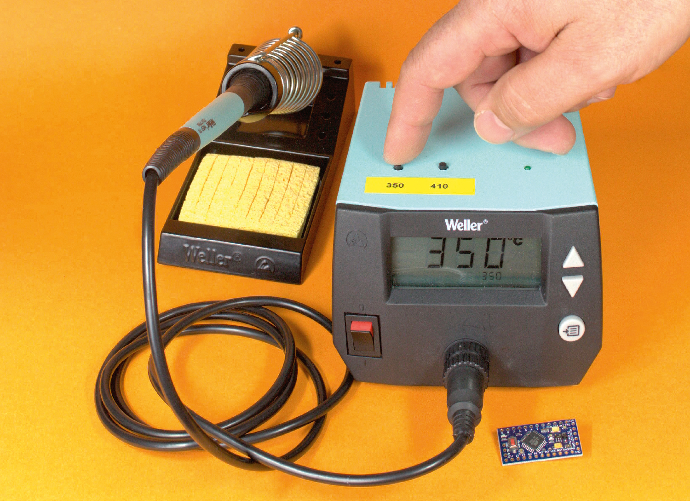

Maker Media GmbH

***

# Speichertasten

## für Weller-Lötstation nachrüsten

**Kann man eine gute Lötstation noch besser machen? Ja, es geht und kostet Sie gerade einmal 10 Euro. Mit dem kleinen Umbau und einem Arduino rüsten Sie Speichertasten für Ihre wichtigsten Löttemperaturen nach und sparen so mehrere hundert Euro.**

Hier gibt es den Code für den Lötstations-Hack im Ordner _[src](./src)_.

Der vollständige Artikel zum Projekt steht sowohl der **[Make-Ausgabe 6/18 ab Seite 122](https://www.heise.de/select/make/2018/6/1545370183276170)** als auch im **[Make-Sonderheft 6/23 "Reparieren und Pflegen" ab Seite 48](https://www.heise.de/select/make/2023/6/2325514421440830160)**.
